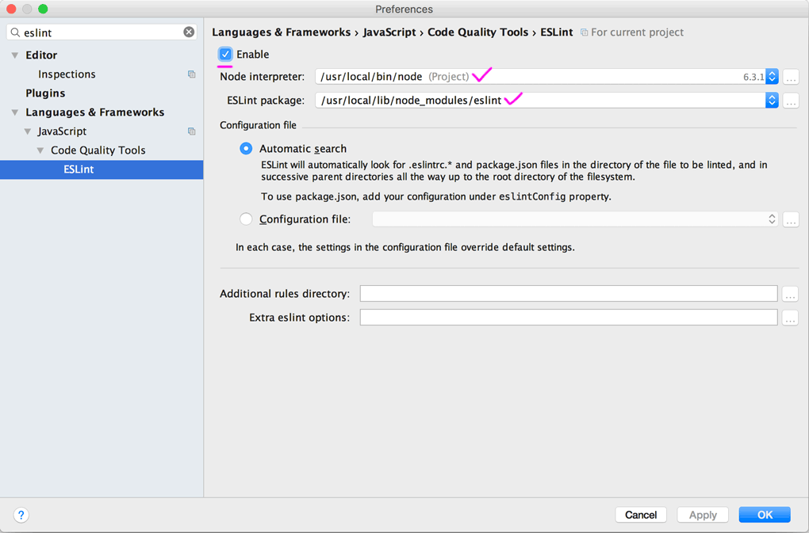

# Конфиги

## Редактор
* [.editorconfig](.editorconfig) содержит настройки отступов, кодировки и переводов каретки для разных файлов. Чтобы он заработал, нужно установить в PHPStorm плагин [`EditorConfig`](https://plugins.jetbrains.com/plugin/7294). Так же имеются [плагины для других редакторов](http://editorconfig.org/#download).

## JS
### Линтер
Код проверяется с помощью ESLint в фоновом режиме в редакторе. ESLint использует файлы [.eslintrc.js](js/.eslintrc.js) для настроек проверки и [.eslintignore](js/.eslintignore) для игнорирования файлов, которые проверять не нужно.

Чтобы в редакторе заработала проверка на основе ESLint, нужно установить пакет (`npm i eslint -g`, можно глобально, использоваться будет везде) и в PHPStorm, включить соответствующую настройку:

### ES6
Предполагается, что файлы с кодом ES6 именуются так: `filename.babel.js`. Исходя из такого именования настраиваются отступы и прочие параметры.

[`.babelrc`](js/.babelrc) — содержит настройки для транспайлера кода ES6 в ES5.